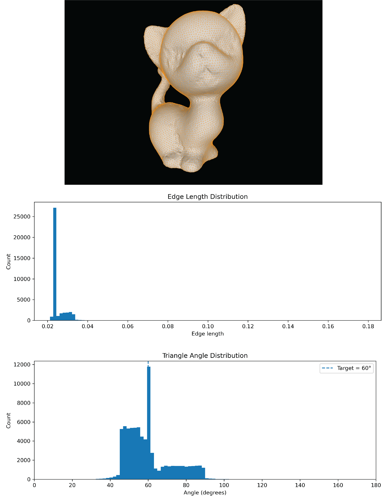
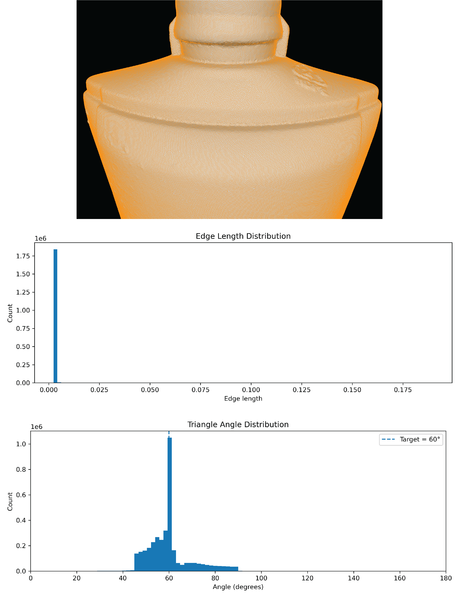
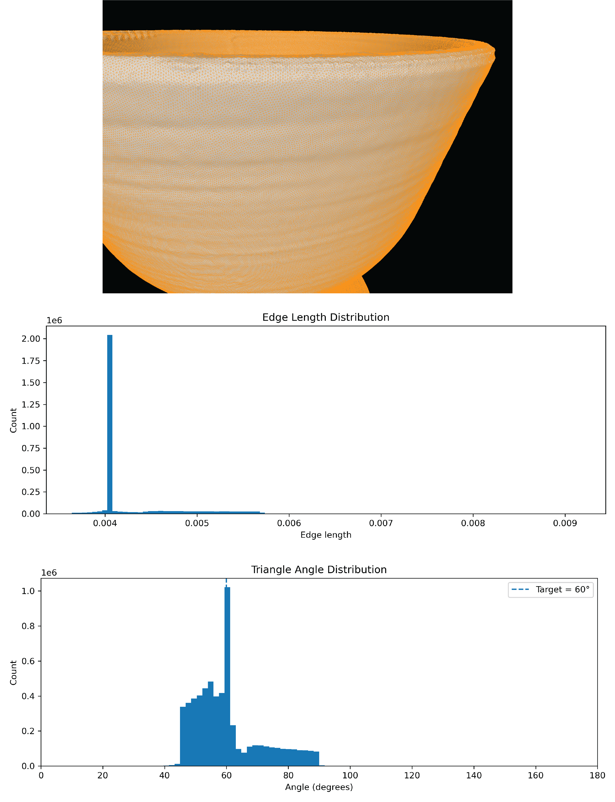
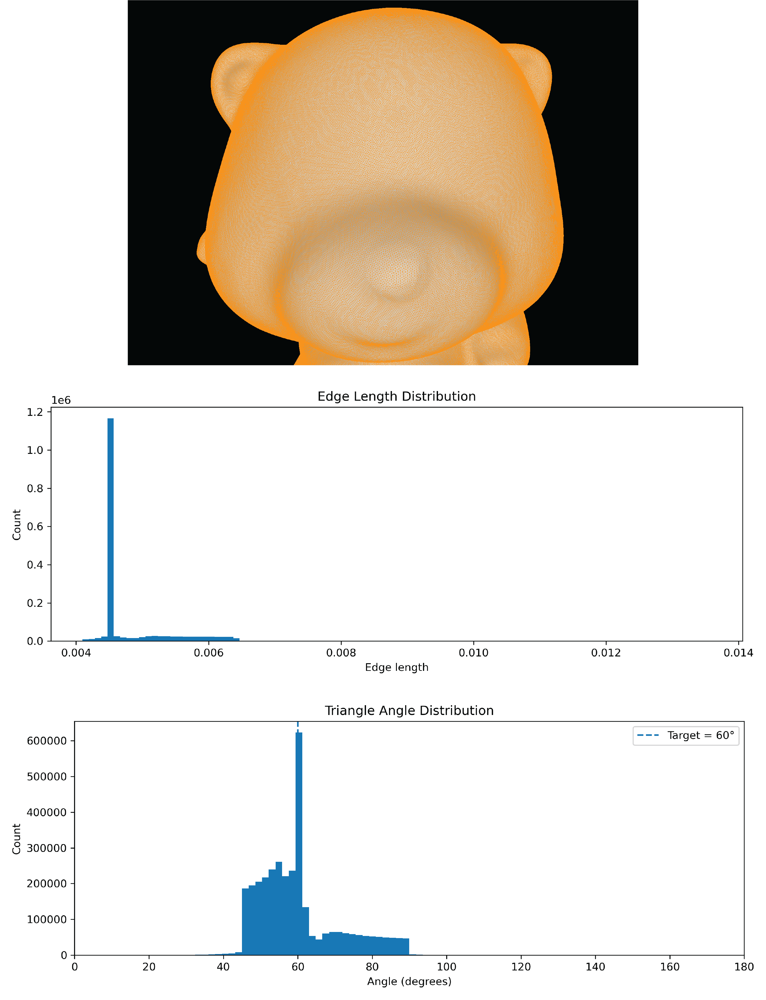
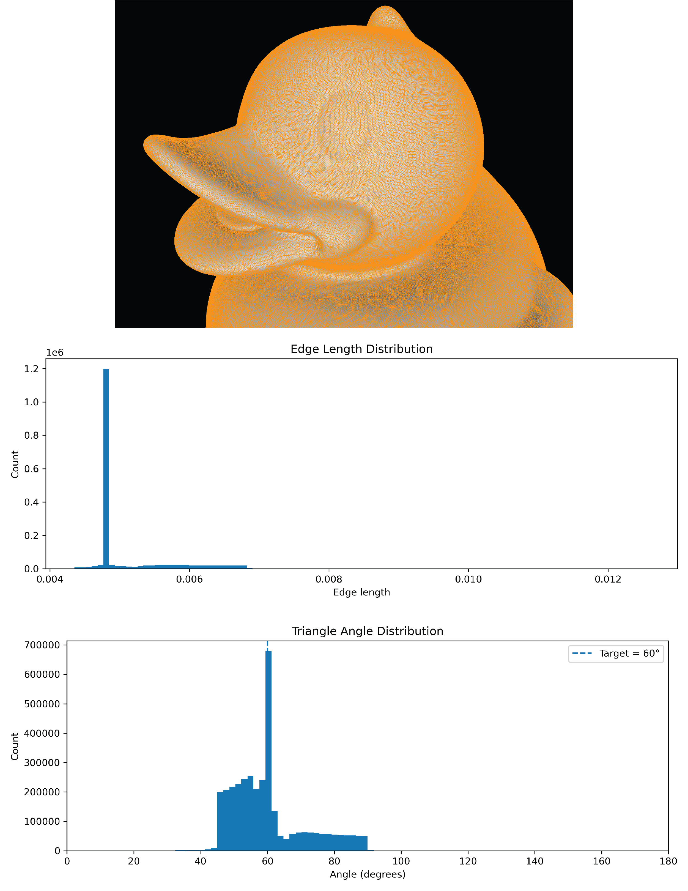
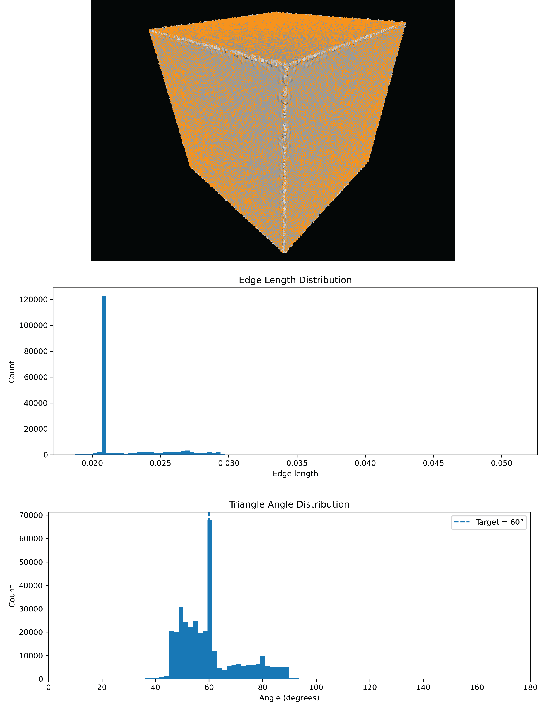
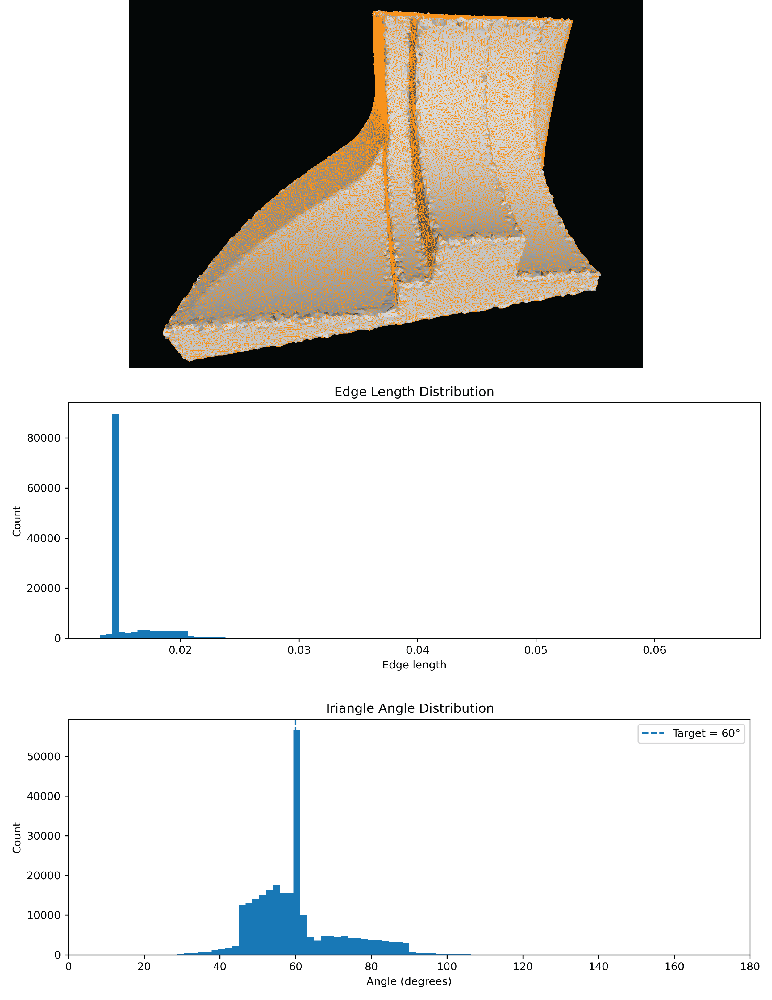
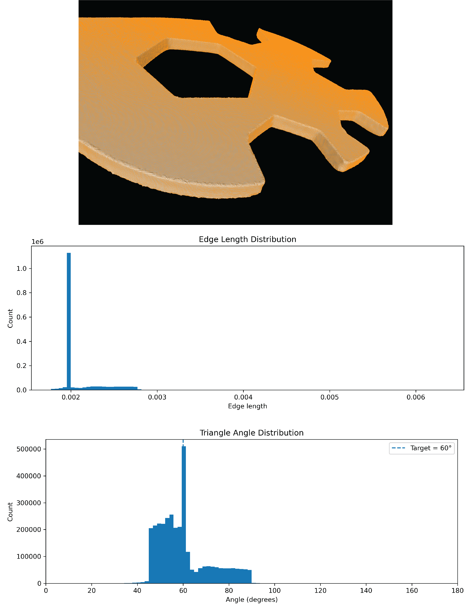

# Splat Surface Reconstruction

Splat Surface Reconstruction is a surface reconstruction method for oriented 3D point clouds. The input consists of a set of three-dimensional points together with consistently oriented normal vectors, and the output is a polygonal surface mesh.

This implementation is based on the method presented in:

> Henriette Lipschütz, Ulrich Reitebuch, Konrad Polthier, and Martin Skrodzki,  
> **Feature-aware manifold meshing and remeshing of point clouds and polyhedral surfaces with guaranteed smallest edge length**

[Paper on arXiv](https://arxiv.org/abs/2305.07570)

The CGAL implementation was developed by **Pranav Jain** as part of **Google Summer of Code 2026**, under the guidance of **Martin Skrodzki** and **Andreas Fabri**.

**Issue raised can be found [here](https://github.com/CGAL/cgal/issues/9606)**

---

## Overview

The method incrementally reconstructs a surface from an oriented point cloud using local splat geometry.

Each input point is associated with a normal vector and an estimated splat radius. Pairs of reconstructed vertices are used to generate candidate points by intersecting a construction circle with nearby splats. Geometrically and topologically valid candidates are inserted into an incremental halfedge graph to grow the reconstructed surface.

The resolution of the reconstruction is controlled by a target edge length derived from the average spacing of the input point cloud.

---

## Algorithm Summary

The reconstruction consists of the following main stages.

### 1. Spatial Grid Construction

The input point cloud is stored in a regular three-dimensional box grid.

The grid is used as a spatial acceleration structure for neighborhood queries and for estimating local surface information. Points falling into the same grid cell contribute to an averaged cell normal.

These cell normals provide local estimates of the surface orientation during reconstruction.

### 2. Splat Size Estimation

A splat radius is estimated independently for each input point.

For a point and its local neighborhood:

1. a tangent plane is constructed from the point normal;
2. neighboring points are projected onto this tangent plane;
3. a two-dimensional Delaunay triangulation is constructed;
4. the circumcenters of triangles incident to the central point are examined;
5. the resulting distances are used to estimate the local splat radius.

The splat size therefore adapts to the local sampling density of the input point cloud.

### 3. Initial Seed

The reconstruction starts from an initial pair of vertices selected from a suitable region of the point cloud.

The two vertices form the first edge of the reconstruction front. Candidate generation then starts from these initial vertices.

### 4. Candidate Generation

New surface vertices are generated from pairs of existing mesh vertices.

Given two parent vertices, a construction circle is formed using the desired edge length. Nearby splats are queried using the box grid.

The construction circle is intersected with the planes of nearby splats. Intersection points that lie inside the corresponding splat disks become candidate positions for extending the reconstructed surface.

### 5. Candidate Validation

Before a candidate is inserted into the mesh, several geometric and topological checks are performed.

These include:

- rejecting candidates that are too close to existing mesh vertices;
- local tangent-plane projection checks;
- intersection checks between proposed and existing edges;
- normal and orientation consistency checks;
- local halfedge ordering checks;
- local topology checks designed to avoid invalid boundary configurations.

Candidates are also assigned priorities according to the state of the reconstruction front.

### 6. Incremental Surface Growth

When a candidate is accepted, a new mesh vertex is inserted and connected to its two parent vertices.

The local halfedge connectivity is explicitly updated by modifying the `next()` relationships around the reconstruction front.

New candidates are then generated from the newly inserted vertex.

This process continues until no valid candidates remain.

### 7. Face Construction and Triangulation

During the growth stage, the algorithm primarily constructs the halfedge connectivity of the surface.

After growth terminates, closed halfedge cycles are detected and converted into faces.

Non-triangular polygonal cycles are triangulated using an ear-clipping procedure. The polygon is projected onto a local tangent plane, candidate ears are evaluated geometrically, and valid ears are committed while updating the remaining halfedge cycle.

---

## Input

The reconstruction expects an **oriented point cloud**.

Each input sample must provide:

- a three-dimensional point position;
- an associated normal vector.

The normal vectors should be consistently oriented. Strongly inconsistent or noisy normals can lead to incorrect local surface estimates and may negatively affect the reconstructed surface.

The example program reads the oriented point cloud from an `.xyz` file.

---

## Reconstruction Scale

The reconstruction uses a target edge length to determine the resolution of the generated mesh.

In the example program, this target edge length is specified relative to the average spacing estimated from the input point cloud.

Let

$begin:math:display$
\\ell\_\{\\mathrm\{avg\}\}
$end:math:display$

denote the estimated average spacing of the input point cloud and let $begin:math:text$s$end:math:text$ denote the user-provided scale factor.

The target edge length is

$begin:math:display$
\\ell\_\{\\mathrm\{target\}\} \= s\\\,\\ell\_\{\\mathrm\{avg\}\}\.
$end:math:display$

Consequently:

- smaller scale values produce a finer reconstruction with shorter edges;
- larger scale values produce a coarser reconstruction with longer edges.

For example, a scale factor of `2` requests a target edge length equal to twice the estimated average spacing of the input point cloud.

---

## Compilation

The example program can be compiled using CMake.

From the example directory, create a build directory:

```bash
mkdir build
cd build
```

Configure the project:

```bash
cmake ..
```

Compile the example:

```bash
make
```

After successful compilation, the executable

```text
splat_reconstruction_function
```

is generated.

---

## Running the Reconstruction

The reconstruction example is executed as:

```bash
./splat_reconstruction_function <point_cloud.{off, xyz}> <scale>
```

The arguments are:

- `<point_cloud.{off, xyz}>` — input oriented point cloud;
- `<scale>` — scale factor used to determine the target edge length.

For example:

```bash
./splat_reconstruction_function cube.off 2
```

Here:

- `cube.off` is the input oriented point cloud;
- `2` is the target edge-length scale factor.

The reconstruction therefore uses a target edge length equal to twice the estimated average spacing of the input point cloud.

---

## Reconstruction Results

The following examples illustrate the behavior of the reconstruction on different oriented point clouds.

### Smooth Surfaces

#### Kitten [(Input File)](inputs/kitten.xyz)

<p align="center">
  
</p>

<p align="center">
  <em>Reconstruction of the kitten model.</em>
</p>

#### Shampoo Bottle [(Input File)](inputs/shampoobottle.xyz)

<p align="center">
  
</p>

<p align="center">
  <em>Reconstruction of the shampoo bottle.</em>
</p>

#### Cup [(Input File)](inputs/cup.xyz)

<p align="center">
  
</p>

<p align="center">
  <em>Reconstruction of the cup model.</em>
</p>

#### Toycat [(Input File)](inputs/toycat.xyz)

<p align="center">
  
</p>

<p align="center">
  <em>Reconstruction of the toycat model.</em>
</p>

#### Duck [(Input File)](inputs/duck.xyz)

<p align="center">
  
</p>

<p align="center">
  <em>Reconstruction of the duck model.</em>
</p>

### Sharp Features

#### Cube [(Input File)](inputs/cube.off)

<p align="center">
  
</p>

<p align="center">
  <em>Reconstruction of the cube model.</em>
</p>

#### Fandisk [(Input File)](inputs/fandisk.off)

<p align="center">
  
</p>

<p align="center">
  <em>Reconstruction of the fandisk model.</em>
</p>

#### Wrench [(Input File)](inputs/wrench.xyz)

<p align="center">
  
</p>

<p align="center">
  <em>Reconstruction of the wrench model.</em>
</p>

---

## Limitations

### Memory Usage

The current implementation uses a **full dense three-dimensional box grid** as its spatial acceleration structure.

If the bounding box dimensions are $begin:math:text$L\_x$end:math:text$, $begin:math:text$L\_y$end:math:text$, and $begin:math:text$L\_z$end:math:text$, and the grid box size is $begin:math:text$h$end:math:text$, the approximate number of cells is

$begin:math:display$
N\_\{\\mathrm\{cells\}\}
\\approx
\\frac\{L\_x L\_y L\_z\}\{h\^3\}\.
$end:math:display$

The memory requirement therefore grows cubically as the box size decreases:

$begin:math:display$
N\_\{\\mathrm\{cells\}\} \\propto \\frac\{1\}\{h\^3\}\.
$end:math:display$

This becomes particularly important when requesting smaller target edge lengths. A smaller edge length requires a smaller grid box size, which can dramatically increase the number of grid cells.

The current implementation allocates the complete grid, including cells that contain no input points. As a result, sufficiently small target edge lengths can cause very high memory consumption and may result in the reconstruction running out of memory.

A future improvement would be to replace the dense box grid with a sparse spatial data structure in which memory usage depends primarily on occupied or relevant cells rather than on the complete volume of the input bounding box.

## Reference

Henriette Lipschütz, Ulrich Reitebuch, Konrad Polthier, and Martin Skrodzki,

**Feature-aware manifold meshing and remeshing of point clouds and polyhedral surfaces with guaranteed smallest edge length**

[arXiv:2305.07570](https://arxiv.org/abs/2305.07570)

---

## Authors

**Pranav Jain**  
**Martin Skrodzki**  
**Andreas Fabri**

Developed as part of **Google Summer of Code 2026**.
